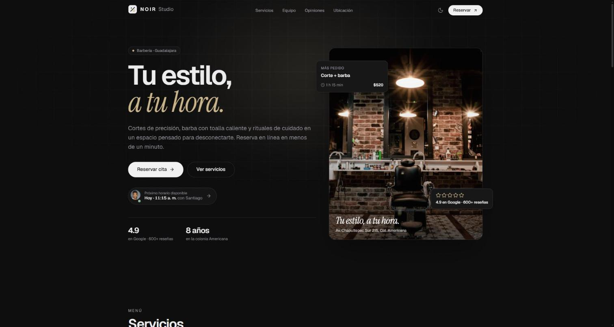
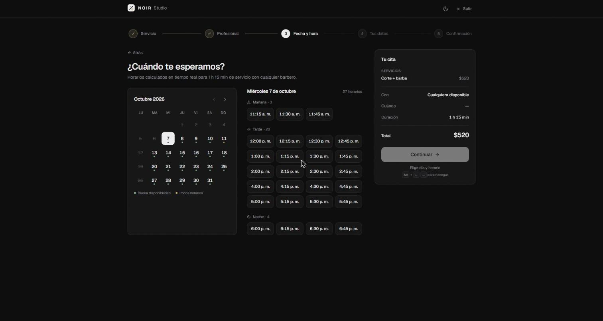
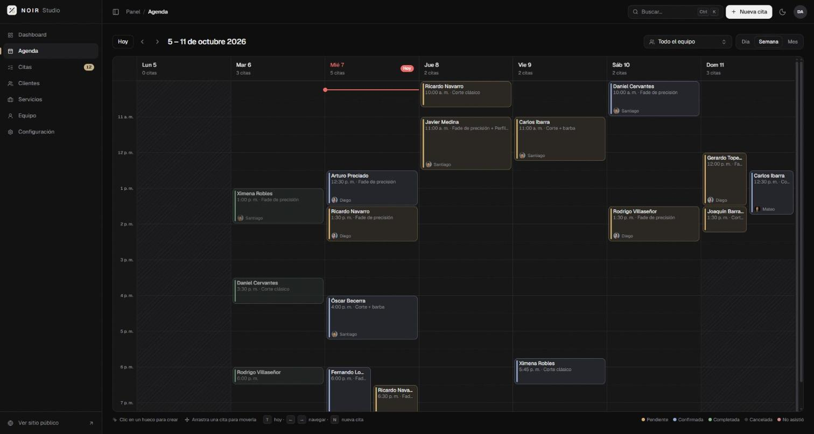
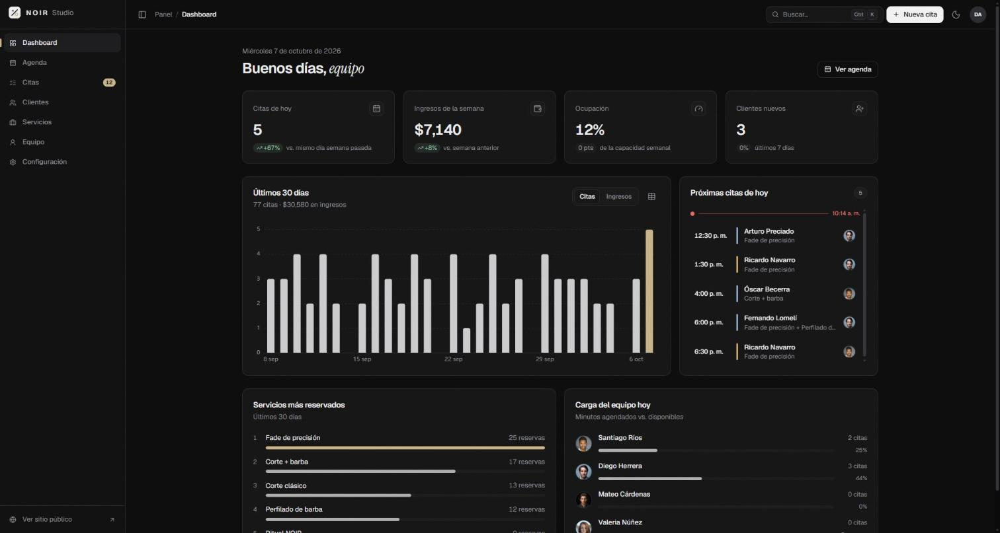

# NOIR Studio — Sistema de citas en línea

Demo de portafolio de un **sistema de reservación de citas con panel de administración** para una barbería premium ficticia en Guadalajara. Construido con Nuxt 4, Vue 3, TypeScript y Tailwind CSS 4, con una identidad monocromática en negro mate y la misma calidad en modo claro y oscuro.

> Todo funciona en el navegador: no hay backend. Los datos semilla se generan con fechas relativas al día de hoy y se guardan en `localStorage`.



| Reservación | Agenda | Dashboard |
|---|---|---|
|  |  |  |

## Qué incluye

**Sitio público**
- Landing con navbar con blur, hero con widget en vivo de *próximo horario disponible*, servicios filtrables, equipo, testimonios en marquee, ubicación con indicador *Abierto ahora / Cierra a las…* y footer.
- **Wizard de reservación** en 5 pasos: servicios (uno o varios), profesional o *cualquiera disponible*, calendario mensual propio + horarios agrupados en mañana/tarde/noche, datos con validación en vivo y confirmación tipo ticket. Resumen fijo en desktop y *bottom sheet* colapsable en móvil; el borrador se persiste para retomarlo si se recarga.
- **Pantalla de la cita** (`/cita/:id`): check animado, folio, *Agregar a Google Calendar*, *Descargar .ics* (generado en el cliente), *Enviar por WhatsApp*, reagendar y cancelar.

**Panel de administración** (`/admin`)
- Login de demostración con las credenciales visibles en pantalla.
- Sidebar colapsable, breadcrumb, buscador y **paleta de comandos `Ctrl + K` / `⌘ + K`**.
- **Dashboard**: KPIs con variación vs. el periodo anterior, tendencia de 30 días (ECharts, sigue al tema y al color de acento; incluye vista de tabla), citas de hoy en línea de tiempo, servicios más reservados y carga del equipo.
- **Agenda propia** con vistas Día (columnas por profesional), Semana (columnas por día) y Mes; línea de *ahora* en tiempo real; clic en un hueco para crear; **arrastrar para mover** validando traslapes y horario laboral (con *Deshacer*); filtro por profesional; vista de lista en móvil.
- **Citas**: tabla con búsqueda, filtros (estado, profesional, rango de fechas), orden, paginación y acciones rápidas.
- **Clientes**: búsqueda y ficha con historial, total gastado, servicio favorito y notas editables.
- **Servicios**: CRUD con validación, activar/desactivar y eliminar con confirmación.
- **Equipo**: CRUD y **editor visual de horario semanal** (bloques y pausas) más días libres.
- **Configuración**: datos del negocio, horario, intervalo entre horarios, margen entre citas, anticipación mínima, días a futuro, **color de acento con vista previa en vivo** y **Restablecer demo**.
- **Sincronización entre pestañas**: una reserva hecha en el sitio público aparece en la agenda abierta en otra pestaña con un toast *Nueva cita* (evento `storage`).

### Atajos de teclado (panel)

| Atajo | Acción |
|---|---|
| `Ctrl/⌘ + K` | Paleta de comandos (acciones, secciones, clientes y folios) |
| `N` | Nueva cita |
| `G` luego `D` · `A` · `C` · `L` · `S` · `E` · `O` | Ir a Dashboard · Agenda · Citas · Clientes · Servicios · Equipo · Configuración |
| `T` · `←` `→` | Agenda: hoy · anterior/siguiente |
| `Alt + ←/→` | Wizard: paso anterior/siguiente |

## Stack

| | |
|---|---|
| Framework | **Nuxt 4.5** (SPA, `ssr: false`) + **Vue 3.5** con `<script setup lang="ts">` y TypeScript estricto |
| Estilos | **Tailwind CSS 4** con tokens semánticos en variables CSS (`app/assets/css/main.css`) |
| Componentes | Primitivos accesibles de **Reka UI** envueltos al estilo shadcn-vue en `app/components/ui` |
| Estado | **Pinia** + `pinia-plugin-persistedstate` (localStorage) |
| Tema | `@nuxtjs/color-mode` (claro/oscuro/sistema, sin parpadeo) + View Transitions API |
| Íconos y fuentes | `@nuxt/icon` (Lucide, empaquetados en el cliente) y `@nuxt/fonts` (Geist + Instrument Serif) |
| Utilidades | `@vueuse/core`, `@vueuse/motion`, `date-fns` (locale `es`), `zod`, `vue-sonner` |
| Gráficas | `vue-echarts` + ECharts (tree-shaking, solo en el panel) |
| Calidad | Vitest (54 pruebas), `@nuxt/eslint`, `vue-tsc` |

## Cómo correrlo

Requisitos: Node 20+ (probado con Node 24 en Windows 10/11, PowerShell).

```powershell
npm install
npm run dev          # http://localhost:3000
```

Otros scripts:

```powershell
npm run test         # pruebas de Vitest
npm run lint         # ESLint
npm run typecheck    # vue-tsc
npm run generate     # build estático en .output/public
npm run preview      # sirve el build estático (npx serve -s)
npm run assets       # regenera favicon, íconos y og.png desde SVG
```

### Credenciales del panel

| Usuario | Contraseña |
|---|---|
| `demo` | `demo123` |

## Despliegue en Cloudflare Pages

1. Conecta el repositorio en **Cloudflare Pages → Create project**.
2. Configuración de build:
   - **Build command:** `npm run generate`
   - **Build output directory:** `.output/public`
   - Variable de entorno opcional: `NODE_VERSION=22`
3. `public/_redirects` (`/* /index.html 200`) hace que recargar cualquier ruta (por ejemplo `/admin/agenda` o `/cita/abc`) cargue la app en lugar de dar 404. Además, `nuxt generate` emite un HTML por cada ruta estática conocida.
4. Cambia `siteUrl` en `config/brand.ts` por tu dominio para que las metas Open Graph apunten a la imagen correcta.

## Adaptarlo a otro giro

Los componentes no contienen textos de la marca. Para convertir el demo en un consultorio, salón o estudio de tatuajes:

1. **`config/brand.ts`** — nombre, wordmark, slogan, giro, dirección, teléfono/WhatsApp, redes, zona horaria, prefijo de folio, URL del sitio e imagen del hero.
2. **`app/app.config.ts`** — horario del negocio, reglas de reservación y color de acento por defecto, **vocabulario** (`terms`: "barbero" → "doctor", "estilista", "tatuador"…) y textos de la landing (`copy`).
3. **`app/data/`** — servicios y categorías, profesionales con su horario, clientes, testimonios y combinaciones de servicios más comunes para generar citas.
4. `npm run assets` si cambias el logo o la imagen OG (`scripts/generate-assets.mjs`).

## Arquitectura

```
app/
  app.config.ts         # horario, reglas, vocabulario del giro y textos
  assets/css/main.css   # tokens claro/oscuro, grano, utilidades y transiciones
  components/
    ui/                 # botones, dialog, sheet, select, tabs, tooltip, dropdown… (Reka UI)
    shared/             # logo, avatar, imagen con fallback, estados vacíos, tema
    landing/            # secciones del sitio público
    booking/            # wizard, calendario, horarios, ticket, reagendar
    admin/              # sidebar, paleta de comandos, agenda, KPIs, gráfica, editores
  composables/          # useAvailability, useBooking, useBrand, useShortcuts, useTheme…
  stores/               # services, staff, appointments, clients, settings, booking, auth, ui
  utils/                # funciones puras: disponibilidad, fechas, ics, whatsapp, folio, formato
  data/                 # datos semilla y generador de citas
  layouts/              # default, focus (wizard), admin, auth
  middleware/admin.ts   # protección de rutas del panel
  pages/
config/brand.ts         # identidad de la marca (fuente única)
types/                  # tipos del dominio
tests/                  # Vitest
scripts/                # generación de assets
```

## Decisiones técnicas

- **Disponibilidad como función pura.** `getAvailableSlots` (`app/utils/availability.ts`) calcula *horario del negocio ∩ horario del profesional − citas existentes (± margen) − duración total*, en intervalos configurables, sin horarios pasados ni dentro de la anticipación mínima. La misma función alimenta el wizard, el reagendado, el diálogo de nueva cita, el widget del hero **y el generador de datos semilla**, por lo que las citas semilla nunca se traslapan (hay pruebas que lo verifican para varias fechas). Con *Cualquiera disponible* se asigna al profesional con menos carga ese día.
- **Fechas sin zonas horarias en el estado.** Las citas guardan `date` (`yyyy-MM-dd`) y `start` (minutos desde medianoche) en hora local del negocio. Evita errores de UTC y simplifica el cálculo de huecos. El `.ics` usa `TZID=America/Mexico_City` con su `VTIMEZONE` (México ya no aplica horario de verano), CRLF, escape y plegado a 75 octetos según RFC 5545.
- **Una métrica por gráfica.** La tendencia del dashboard alterna *Citas* / *Ingresos* en lugar de usar doble eje, que confunde la lectura; incluye vista de tabla accesible. Los colores se leen de los tokens CSS, así que la gráfica cambia con el tema y con el acento.
- **Semilla relativa al día de hoy.** Además de las ~40 citas entre la semana pasada y las próximas dos semanas, se genera un historial ligero de 30 días para que el dashboard tenga datos. `Restablecer demo` vuelve a generar todo con la fecha actual.
- **SEO en un SPA.** Las metas Open Graph se declaran en `nuxt.config.ts` (desde `config/brand.ts`) para que estén en el HTML estático: los crawlers de WhatsApp y Facebook no ejecutan JavaScript.
- **Componentes ui propios sobre Reka UI.** Se siguió la estructura de shadcn-vue pero como *wrappers* compuestos (`UiDialog`, `UiSheet`, `UiSelect`…) con estilos propios; la paleta de comandos usa `Listbox` de Reka.
- **Nuxt fijado en 4.5.2.** Nuxt 4.6.0 (publicado dos días antes de construir el demo) fallaba al renderizar el shell del SPA (`Either manifest or precomputed data must be provided`) tanto en `dev` como en `generate`.
- **VueUse 15** cambió `useNow`: ya no acepta `interval`, ahora recibe un `scheduler`. El reloj compartido usa `useIntervalFn` de 30 s para no recalcular la agenda en cada frame.
- **Mensajes de WhatsApp sin emojis.** El redireccionamiento de `wa.me` corrompe caracteres fuera del BMP; se usan etiquetas de texto.

## Calidad

- `npm run test`: **54 pruebas** (cierres, descansos, citas traslapadas, servicios combinados, margen, anticipación que cruza la medianoche, `.ics`, formato de hora/precio, datos semilla sin traslapes).
- `npm run lint` y `npm run typecheck`: sin errores.
- Lighthouse sobre el build estático (landing):

| | Rendimiento | Accesibilidad | Buenas prácticas | SEO |
|---|---|---|---|---|
| Desktop | 98 | 100 | 100 | 100 |
| Móvil (simulado) | 79 | 100 | 100 | 100 |

  En móvil el rendimiento está limitado por ser SPA (`ssr: false`): el contenido aparece después de cargar el JavaScript. Ya se precarga la imagen del hero y se difieren las secciones bajo el pliegue; para pasar de 90 habría que prerenderizar la landing.

## Notas

- Marca, personas, teléfonos y reseñas son **ficticios**. Imágenes de [Unsplash](https://unsplash.com), con placeholder si fallan.
- `npm audit` reporta vulnerabilidades en dependencias de desarrollo de Nuxt (`@nuxt/devtools` → `simple-git`); no llegan al sitio estático.

---

Demo desarrollado por **JacoboDev** · [jacobodev.pages.dev](https://jacobodev.pages.dev)
